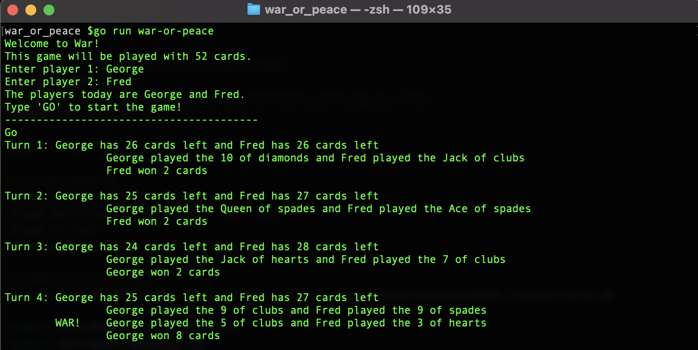

# War (or Peace)

War (or Peace) is a command line application built to practice Go development and testing skills. The program simulates the card game War,played by two players using a standard 52-card playing card deck. 

### Game Play
The deck is divided equally between the two players. The players each play a card at the same time and the player with the higher card wins the turn and puts both cards in the bottom of thier deck. 

If the cards are the same rank the players go to War. Each player then deals out the top three cards from their deck, face down. They then turn over the top card, and the player with the higher card takes both piles (8 cards). If the turned-up cards are the same rank, the players turn over the second card and, if needed, the third. If all three cards are the same rank, the turn ends in Mutually Assured Destruction (e.g., a draw). The cards are removed from play, and the game continues. 

The game ends when one player loses all their cards, or when a war begins but one (or both) players does not have enough cards to complete it.
  

## Local Setup
To run the project in your local environment, follow the instructions below:

  1. Clone the repository: 
    `git clone git@github.com:cunninghamge/war-or-peace-go.git` 
    `cd war-or-peace-go`
  2. Install Go with 
    `brew install go`
  3. To run tests: 
    `go test ./...` 
    or, to run tests with a detailed coverage report, run: 
    `go test ./... -v -coverprofile cover.out` 
    `go tool cover -html=cover.out` 

## Game Play
Launch the game in the command line by running  `go run war-or-peace`

You can run the program with your own set of cards using a CSV file. The file should not have headers, and each line must have three fields: a value, a suit, and a rank. See `./fixtures/cards.csv` for an example (these are the default cards for playing the game). To play with a custom set of cards, pass the location of your CSV file as an argument when launching the game, e.g.  `go run flash_cards ./fixtures/test_cards.csv`
